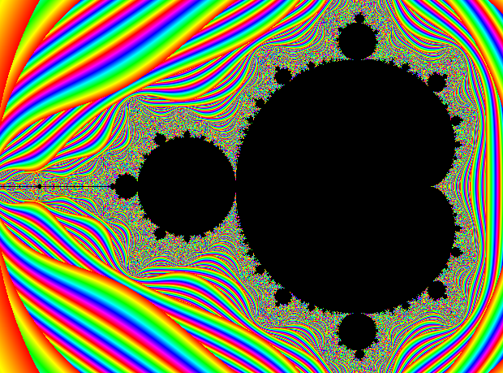

# Mandelbrot set



## Overview
Sets, Collections and Series. We see them everywhere. In nature, in science, in mathematics. We can see them even in music and literature. Some of them are just plain enumerations, like steps in a cooking recipe to prepare a tasty meal, but there are others which are special, like this one, the Mandelbrot Set.

## Installation
1. make sure you have [Raylib](#) installed on your machine
2. cd into the project folder and run these commands:
```shell
make
make run
```

## Features
At this moment it's just a visualization of the set, in the `mandelbrot.c` file at the top you have these parameters to tweak the `zoom` and `center`. It also sets the number of `iterations` which also determines the resolution (although it still isn't enough to make those beautiful and deep zooms).

- [x] basic visualization
- [x] hue colors 
- [ ] better resolution when deep-zooming
- [ ] a simple GUI to control interactively some of the parameters
